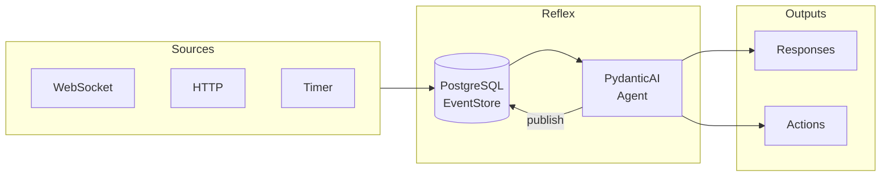

<div align="center">

# Reflex

**Event-Driven AI Agent Framework**

Build real-time AI agents that react to events, maintain state, and scale horizontally.

[](https://github.com/alexnodeland/reflex/actions/workflows/ci.yml)
[](https://alexnodeland.github.io/reflex)
[](https://www.python.org/downloads/)
[](https://opensource.org/licenses/MIT)
[](https://github.com/astral-sh/ruff)

[Documentation](https://alexnodeland.github.io/reflex) · [Getting Started](docs/getting-started.md) · [Examples](examples/)

</div>

---

## ⚡ Why Reflex?

Traditional chatbots are request/response systems. Reflex agents are **continuous control systems** that:

| Traditional Chatbot | Reflex Agent |
|---------------------|--------------|
| Responds to single requests | Reacts to streams of events |
| Stateless between calls | Persistent state across interactions |
| Single input source | Multiple sources (WebSocket, HTTP, timers) |
| Manual retry handling | Automatic retry with exponential backoff |
| Scale by replication | Scale with concurrent consumers |

## 🏗️ Architecture



Events flow through PostgreSQL LISTEN/NOTIFY for real-time pub/sub. Failed events retry with exponential backoff. Exceeded retries go to a dead-letter queue for manual inspection.

## 📦 Installation

Choose the method that fits your use case:

### Option 1: Copier (Recommended)

Create a customized project with [Copier](https://copier.readthedocs.io/). This lets you name your package, exclude examples/docs, and receive upstream updates.

```bash
# Install copier
pipx install copier

# Create your project
copier copy gh:alexnodeland/reflex my-agent

# Later, pull upstream updates
cd my-agent
copier update
```

### Option 2: GitHub Template

Click **"Use this template"** on GitHub to create a new repository with the full codebase.

### Option 3: Git Clone

For exploring or contributing:

```bash
git clone https://github.com/alexnodeland/reflex my-agent
cd my-agent
```

## 🚀 Quick Start

```bash
# Configure environment
cp .env.example .env
# Edit .env with your API keys

# Start everything (includes PostgreSQL)
docker compose up
```

**Endpoints:**

| Service | URL |
|---------|-----|
| API | http://localhost:8000 |
| WebSocket | ws://localhost:8000/ws |
| Health | http://localhost:8000/health |
| Docs | http://localhost:8000/docs |

**Send your first event:**

```bash
# Via HTTP
curl -X POST http://localhost:8000/events \
  -H "Content-Type: application/json" \
  -d '{"type": "http", "payload": {"message": "Hello, Reflex!"}}'

# Or connect via WebSocket
websocat ws://localhost:8000/ws
```

## ✨ Features

### Event-Driven Processing

Define custom events with automatic registration:

```python
from reflex.core.events import EventRegistry, BaseEvent

@EventRegistry.register
class OrderEvent(BaseEvent):
    type: Literal["order.created"] = "order.created"
    order_id: str
    amount: float
```

### Composable Filters

Match events with chainable filter logic:

```python
from reflex.agent.filters import type_filter, keyword_filter

# Combine filters with & (and), | (or), ~ (not)
important_orders = (
    type_filter("order.created")
    & keyword_filter("amount", lambda x: x > 100)
)
```

### Trigger-Based Routing

Connect filters to agents declaratively:

```python
from reflex.agent.triggers import Trigger

Trigger(
    name="high-value-orders",
    filter=important_orders,
    agent=order_processor_agent,
)
```

### Built-in Observability

Integrated tracing via [Logfire](https://pydantic.dev/logfire) for full visibility into event flow, agent execution, and tool calls.

## 🔧 Tech Stack

| Component | Technology |
|-----------|------------|
| Framework | [FastAPI](https://fastapi.tiangolo.com/) |
| AI Agent | [PydanticAI](https://ai.pydantic.dev/) |
| Database | [PostgreSQL](https://www.postgresql.org/) |
| Pub/Sub | PostgreSQL LISTEN/NOTIFY |
| Observability | [Logfire](https://pydantic.dev/logfire) |
| Type Checking | [Pyright](https://github.com/microsoft/pyright) |
| Linting | [Ruff](https://github.com/astral-sh/ruff) |

## 📚 Documentation

| Guide | Description |
|-------|-------------|
| [Getting Started](docs/getting-started.md) | Setup and first steps |
| [Architecture](docs/architecture.md) | System design and event flow |
| [Extending](docs/extending.md) | Custom events, agents, and filters |
| [Configuration](docs/configuration.md) | Environment variables |
| [Development](docs/development.md) | Commands and testing |
| [Scaling](docs/scaling.md) | Horizontal scaling |
| [Operations](docs/operations.md) | DLQ and observability |

## 🛠️ Development

```bash
make dev          # Start with hot reload
make test         # Run tests in Docker
make lint         # Check code quality
make type-check   # Run pyright
make ci           # Full CI pipeline locally
make docs         # Serve docs locally
```

## 📁 Project Structure

```
src/reflex/
├── infra/     # Infrastructure (EventStore, database) - keep stable
├── core/      # Core types (events, deps, errors) - extend carefully
├── agent/     # Agent logic (triggers, filters) - primary extension point
└── api/       # FastAPI routes and WebSocket handlers
```

## 🤝 Contributing

See [CONTRIBUTING.md](CONTRIBUTING.md) for development guidelines.

## 📄 License

MIT License - see [LICENSE](LICENSE) for details.
