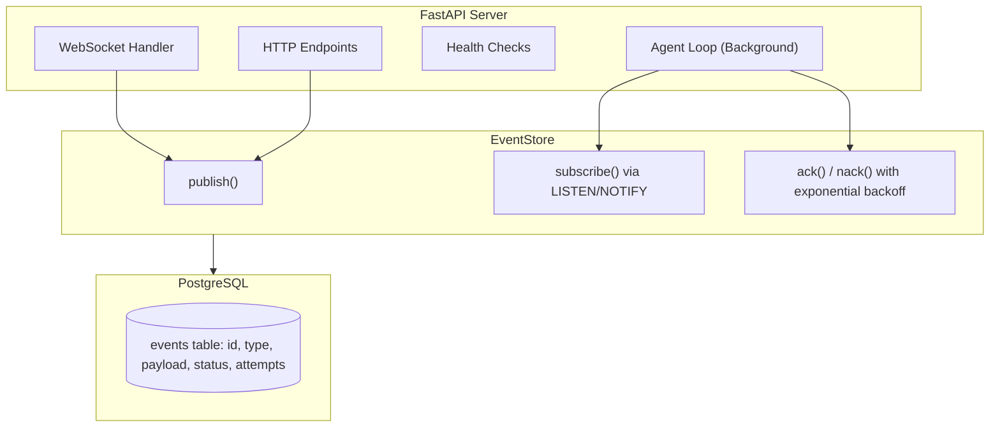
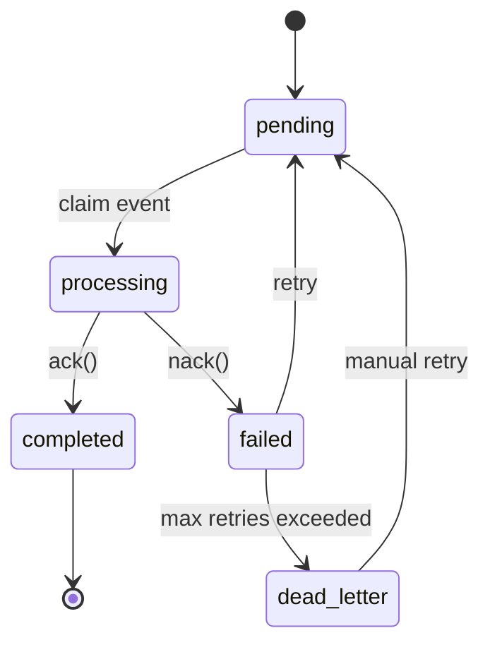

# Architecture

Reflex is an event-driven AI agent framework using PostgreSQL LISTEN/NOTIFY for real-time pub/sub.

## System Overview

## Event Flow

1. **Ingestion** - Events arrive via WebSocket or HTTP
2. **Persistence** - EventStore persists to PostgreSQL and fires NOTIFY
3. **Processing** - Agent loop receives events via subscribe()
4. **Execution** - PydanticAI agent processes with tools
5. **Completion** - Events are ack'd (completed) or nack'd (retry with backoff)

## Key Components

| Component | Location | Purpose |
|-----------|----------|---------|
| **EventStore** | `src/reflex/infra/store.py` | Persistent event queue with pub/sub |
| **Events** | `src/reflex/core/events.py` | Pydantic models with discriminated unions |
| **EventRegistry** | `src/reflex/core/events.py` | Runtime event type registration |
| **Triggers** | `src/reflex/agent/triggers.py` | Filter + agent connections |
| **Filters** | `src/reflex/agent/filters.py` | Event matching predicates |
| **Dependencies** | `src/reflex/core/deps.py` | Dependency injection containers |
| **Agent** | `src/reflex/agent/agents.py` | PydanticAI agent with tools |
| **API** | `src/reflex/api/app.py` | FastAPI with WebSocket support |
| **Config** | `src/reflex/config.py` | Pydantic-settings configuration |

## Module Organization

!!! info "Extension Points"

    The modules are designed with different stability guarantees:

=== "Infrastructure (`infra/`)"

    **Keep stable** - Core infrastructure that rarely changes.

    - `database.py` - PostgreSQL connection setup
    - `store.py` - EventStore implementation

=== "Core (`core/`)"

    **Extend carefully** - Foundational types used throughout.

    - `events.py` - Event definitions & registry
    - `deps.py` - Dependency containers
    - `errors.py` - Structured error handling
    - `types.py` - Protocol definitions

=== "Agent (`agent/`)"

    **Primary extension point** - Where you build your agent logic.

    - `agents.py` - PydanticAI agent and tools
    - `triggers.py` - Trigger definitions
    - `filters.py` - Event filters

=== "API (`api/`)"

    **Modify as needed** - HTTP/WebSocket interface.

    - `app.py` - FastAPI application

## Event States

Events progress through these states:

| State | Description |
|-------|-------------|
| `pending` | Waiting to be processed |
| `processing` | Currently being handled by an agent |
| `completed` | Successfully processed (`ack()`) |
| `failed` | Processing failed, will retry (`nack()`) |
| `dead_letter` | Max retries exceeded, requires manual intervention |
