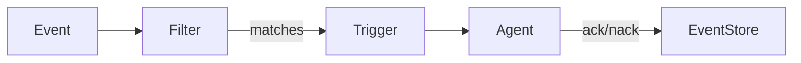
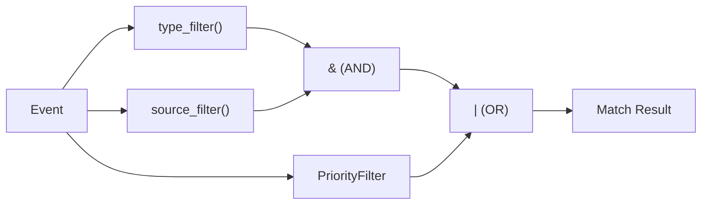

# Extending Reflex

This guide covers how to extend Reflex with custom components.



## Table of Contents

- [Custom Event Types](#custom-event-types)
- [Custom Agents](#custom-agents)
- [Custom Filters](#custom-filters)
- [Custom Trigger Functions](#custom-trigger-functions)
- [Distributed Deployments](#distributed-deployments)

---

## Custom Event Types

Reflex supports custom event types through the `EventRegistry`. This allows you to define domain-specific events without modifying core code.

### Creating a Custom Event

```python
from typing import Literal
from reflex import BaseEvent, EventRegistry

@EventRegistry.register
class OrderEvent(BaseEvent):
    """Custom event for order processing."""

    type: Literal["order.created"] = "order.created"
    order_id: str
    customer_id: str
    total: float
    items: list[str]
```

### Key Requirements

1. **Inherit from `BaseEvent`**: All custom events must inherit from `BaseEvent`
2. **Define a `type` field**: Use `Literal` type with a unique string value
3. **Register with `@EventRegistry.register`**: This adds the event to the global registry

### Using Custom Events

```python
# Create and publish
event = OrderEvent(
    source="checkout-service",
    order_id="ord-123",
    customer_id="cust-456",
    total=99.99,
    items=["SKU-001", "SKU-002"],
)
await store.publish(event)

# Parse from JSON (automatically uses correct type)
data = {"type": "order.created", "source": "api", ...}
event = EventRegistry.parse(data)  # Returns OrderEvent instance
```

### Dynamic Type Union

For Pydantic validation with custom types:

```python
from reflex import get_event_union

# Get union including all registered types
EventUnion = get_event_union()

# Use in Pydantic models
class EventRequest(BaseModel):
    event: EventUnion
```

---

## Custom Agents

Agents process events and produce responses. Reflex provides multiple ways to create agents.

### Using SimpleAgent (Recommended)

The simplest way to create an agent:

```python
from reflex import SimpleAgent, AgentContext

async def process_order(ctx: AgentContext) -> dict:
    """Process an order event."""
    event = ctx.event

    # Your processing logic
    result = await validate_order(event.order_id)

    # Optionally publish derived events
    if result.needs_review:
        review_event = ctx.derive_event(
            ReviewEvent,
            order_id=event.order_id,
            reason=result.reason,
        )
        await ctx.publish(review_event)

    return {"status": "processed", "order_id": event.order_id}

order_agent = SimpleAgent(process_order)
```

### Using BaseAgent (More Control)

For more complex agents with setup/teardown:

```python
from reflex import BaseAgent, AgentContext

class OrderProcessingAgent(BaseAgent):
    """Agent with custom initialization."""

    def __init__(self, validator_url: str):
        self.validator_url = validator_url

    async def run(self, ctx: AgentContext) -> dict:
        """Process the event."""
        async with ctx.deps.http as client:
            response = await client.post(
                self.validator_url,
                json=ctx.event.model_dump(),
            )
        return response.json()

agent = OrderProcessingAgent("https://validator.example.com/validate")
```

### Using PydanticAI Agents

For AI-powered agents:

```python
from pydantic_ai import Agent
from reflex import ReflexDeps

order_classifier = Agent(
    "openai:gpt-4o-mini",
    deps_type=ReflexDeps,
    system_prompt="Classify order events by priority...",
)

@order_classifier.tool
async def get_customer_history(ctx: RunContext[ReflexDeps], customer_id: str) -> str:
    """Fetch customer order history."""
    # Use injected dependencies
    async with ctx.deps.db as session:
        # Query database...
        pass
```

---

## Custom Filters

Filters determine which events trigger which agents. Filters can be composed using logical operators.



### Creating a Class-Based Filter

```python
from reflex import EventFilter, FilterContext

class PriorityFilter(EventFilter):
    """Filter events by priority level."""

    def __init__(self, min_priority: int):
        self.min_priority = min_priority

    def matches(self, event: Event, context: FilterContext | None = None) -> bool:
        priority = getattr(event, "priority", 0)
        return priority >= self.min_priority
```

### Composing Filters

Filters support logical operators:

```python
from reflex import type_filter, source_filter, keyword_filter

# AND composition
high_priority_errors = (
    type_filter("error")
    & source_filter("production-*")
    & PriorityFilter(min_priority=8)
)

# OR composition
alert_worthy = type_filter("error", "critical") | PriorityFilter(10)

# NOT composition
not_internal = ~source_filter("internal-*")

# Complex composition
production_alerts = high_priority_errors & not_internal
```

### Stateful Filters

For filters that need history:

```python
from reflex import EventFilter, FilterContext

class BurstFilter(EventFilter):
    """Detect event bursts."""

    def __init__(self, threshold: int, window_seconds: int):
        self.threshold = threshold
        self.window_seconds = window_seconds

    def matches(self, event: Event, context: FilterContext | None = None) -> bool:
        if context is None:
            return False

        # Count recent events of same type
        recent = context.window(seconds=self.window_seconds)
        same_type = [e for e in recent if e.type == event.type]

        return len(same_type) >= self.threshold
```

---

## Custom Trigger Functions

Trigger functions provide fine-grained control over when agents execute.

### Creating a Trigger Function

```python
from reflex import TriggerFunc, DecisionContext, Event

def high_value_order_trigger(threshold: float) -> TriggerFunc:
    """Trigger on high-value orders."""

    def check(event: Event, context: DecisionContext) -> dict | None:
        if not hasattr(event, "total"):
            return None

        if event.total >= threshold:
            context.mark_action()  # Reset context
            return {
                "reason": "high_value_order",
                "total": event.total,
                "threshold": threshold,
            }

        return None

    return check
```

### Registering Triggers

```python
from reflex import trigger, type_filter

@trigger(
    name="high-value-orders",
    filter=type_filter("order.created"),
    trigger_func=high_value_order_trigger(threshold=1000.0),
    agent=order_review_agent,
    priority=10,
)
def handle_high_value_orders():
    pass
```

### Built-in Trigger Functions

Reflex provides common trigger patterns:

```python
from reflex import (
    immediate_trigger,      # Fire on every matching event
    error_threshold_trigger,  # Fire after N errors in time window
    periodic_summary_trigger,  # Fire every N events
)

# Fire immediately
trigger_func = immediate_trigger()

# Fire after 5 errors in 60 seconds
trigger_func = error_threshold_trigger(threshold=5, window_seconds=60)

# Fire every 100 events
trigger_func = periodic_summary_trigger(event_count=100)
```

---

## Distributed Deployments

For production deployments with multiple instances.

### PostgreSQL-Based Locking

Enable distributed locking to prevent duplicate processing:

```python
# In your .env or settings
LOCK_BACKEND=postgres
```

This uses PostgreSQL advisory locks to ensure only one instance processes each event scope at a time.

### Event Store Configuration

Configure retry behavior:

```python
# .env
EVENT_MAX_ATTEMPTS=5          # Max retry attempts
EVENT_RETRY_BASE_DELAY=2.0    # Base delay in seconds
EVENT_RETRY_MAX_DELAY=300.0   # Max delay (5 minutes)
```

### Health Monitoring

Use the detailed health endpoint for monitoring:

```bash
curl http://localhost:8000/health/detailed
```

Response:
```json
{
  "status": "healthy",
  "indicators": [
    {"name": "database", "status": "healthy", "latency_ms": 1.5},
    {"name": "event_queue", "status": "healthy", "message": "42 pending"},
    {"name": "dlq", "status": "healthy", "message": "0 in DLQ"}
  ]
}
```

### Scaling Considerations

1. **Horizontal Scaling**: Run multiple API instances behind a load balancer
2. **Event Processing**: Run multiple agent loop instances (locking prevents duplicates)
3. **Database Pooling**: Configure pool size based on instance count:
   ```
   DATABASE_POOL_SIZE=5
   DATABASE_POOL_MAX_OVERFLOW=10
   ```

---

## Next Steps

- See [examples/basic/](../examples/basic/) for a complete working example
- Check the API reference for detailed documentation
- Join our community for support and discussions
