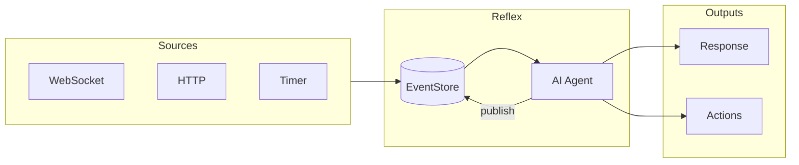

# Reflex

**Real-time AI Agent Framework**

Reflex is a production-ready template for building real-time AI agents as continuous control systems. Unlike request/response chatbots, Reflex agents run as persistent processes that react to events from multiple sources.



## Features

- **Event-driven** - React to WebSocket, HTTP, and timer events
- **Persistent state** - Events stored in PostgreSQL with automatic retry
- **Observable** - Built-in tracing via Logfire
- **Scalable** - Horizontal scaling with concurrent consumers

## Quick Start

```bash
git clone https://github.com/alexnodeland/reflex my-agent
cd my-agent
cp .env.example .env
docker compose up
```

Your agent is now running:

| Endpoint | URL |
|----------|-----|
| API | `http://localhost:8000` |
| WebSocket | `ws://localhost:8000/ws` |
| Health | `http://localhost:8000/health` |

## Project Structure

```
reflex/
├── src/reflex/
│   ├── infra/     # Infrastructure - keep stable
│   ├── core/      # Core types - extend carefully
│   ├── agent/     # Agent logic - primary extension point
│   └── api/       # FastAPI routes
├── tests/         # Test suite
├── scripts/       # Utilities (replay, DLQ)
├── examples/      # Working examples
└── docs/          # Documentation
```

## Next Steps

<div class="grid cards" markdown>

-   :material-rocket-launch:{ .lg .middle } **Getting Started**

    ---

    Set up your development environment and run your first agent

    [:octicons-arrow-right-24: Quick start](getting-started.md)

-   :material-sitemap:{ .lg .middle } **Architecture**

    ---

    Understand the event-driven design and key components

    [:octicons-arrow-right-24: Architecture](architecture.md)

-   :material-puzzle:{ .lg .middle } **Extending**

    ---

    Add custom events, agents, filters, and triggers

    [:octicons-arrow-right-24: Extending guide](extending.md)

-   :material-cog:{ .lg .middle } **Configuration**

    ---

    Environment variables and settings

    [:octicons-arrow-right-24: Configuration](configuration.md)

</div>
