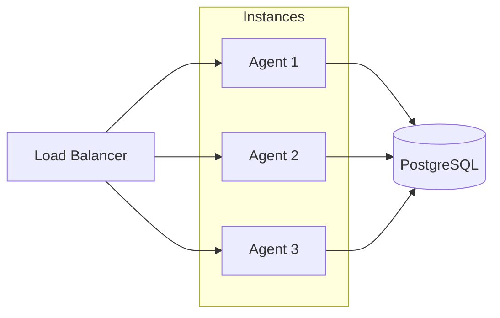

# Scaling

Strategies for scaling Reflex beyond single-instance deployments.

## Current Architecture

The default implementation uses PostgreSQL's LISTEN/NOTIFY for real-time event delivery.

!!! success "Good For"
    - Single-region deployments
    - Moderate throughput (thousands of events/second)
    - Teams wanting minimal infrastructure

## Horizontal Scaling

The design supports multiple concurrent consumers out of the box:



```yaml title="docker-compose.yml"
services:
  agent:
    deploy:
      replicas: 3
```

Events are claimed with `FOR UPDATE SKIP LOCKED`, preventing duplicate processing across instances.

!!! warning "Required Configuration"
    Enable distributed locking when running multiple instances:
    ```bash
    LOCK_BACKEND=postgres
    ```

## Scaling Beyond PostgreSQL

For higher scale requirements, the EventStore interface is designed to be swappable.

### Redis Streams

Recommended for high throughput scenarios:

```python title="Future: Redis-backed EventStore"
class RedisEventStore:
    """Drop-in replacement using Redis Streams."""

    async def publish(self, event: Event) -> str:
        ...

    async def subscribe(self, event_types: list[str]) -> AsyncIterator[Event]:
        ...
```

| Benefit | Description |
|---------|-------------|
| **Higher throughput** | 100k+ events/second |
| **Consumer groups** | Built-in load balancing |
| **Persistence** | Optional with AOF/RDB |
| **Fan-out** | Native pub/sub patterns |

### Migration Path

1. Implement `RedisEventStore` with same interface
2. Add `EVENT_BACKEND` config option (`postgres` | `redis`)
3. Swap implementation in dependency injection
4. PostgreSQL remains for event history/replay

## Scaling Checklist

=== "Single Instance"

    - [x] Default configuration works
    - [x] PostgreSQL handles events and locking
    - [ ] Consider Logfire for observability

=== "Multiple Instances"

    - [x] Set `LOCK_BACKEND=postgres`
    - [x] Configure pool size: `DB_POOL_MAX = total_instances × 5`
    - [x] Use load balancer for API traffic
    - [x] Monitor DLQ for failed events

=== "High Throughput"

    - [x] Implement Redis EventStore
    - [x] Separate read/write database replicas
    - [x] Add caching layer for hot data
    - [x] Consider event batching

## Pool Sizing

Configure connection pool based on instance count:

```bash
# Per-instance settings
DB_POOL_MIN=5
DB_POOL_MAX=20

# Total connections = instances × DB_POOL_MAX
# For 3 instances: 3 × 20 = 60 connections max
```

!!! tip "PostgreSQL max_connections"
    Ensure your PostgreSQL `max_connections` setting accommodates:
    ```
    max_connections >= (instances × DB_POOL_MAX) + buffer
    ```
