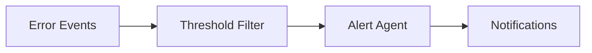
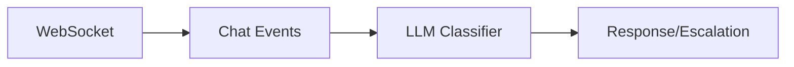
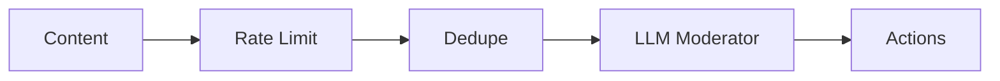
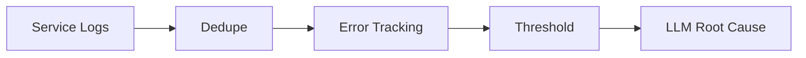
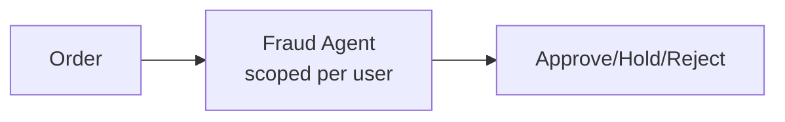
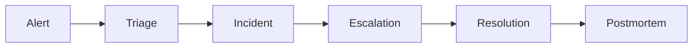

# Reflex Examples

This directory contains example applications demonstrating Reflex's capabilities.

## 📚 Available Examples

| Example | Description | Key Features |
|---------|-------------|--------------|
| [Basic](./basic/) | Error monitoring with threshold alerts | Events, triggers, simple agents |
| [Support Bot](./support_bot/) | AI-powered customer support | WebSocket, LLM agents, escalation |
| [Content Moderation](./content_moderation/) | Real-time content filtering | Rate limiting, deduplication, LLM classification |
| [Log Anomaly](./log_anomaly/) | Multi-service log aggregation | Threshold triggers, LLM correlation |
| [Fraud Detection](./fraud_detection/) | E-commerce order fraud prevention | Scoped locking, LLM tools, event lineage |
| [Incident Response](./incident_response/) | PagerDuty-like incident management | Full lifecycle, escalation chains, runbooks |

## 🔍 Quick Comparison

### Basic Example
**Best for**: Learning core concepts



Features demonstrated:
- Custom event types with `@EventRegistry.register`
- Trigger registration with `@trigger` decorator
- Composable filters (`type_filter() & source_filter()`)
- Event derivation and publishing

### Support Bot Example
**Best for**: Real-time chat applications



Features demonstrated:
- WebSocket integration
- PydanticAI agent with structured output
- Agent tools for context retrieval
- Event chains (message → response → escalation)
- Scoped concurrency per conversation

### Content Moderation Example
**Best for**: High-volume content filtering



Features demonstrated:
- Stateful filters (rate limiting, deduplication)
- LLM-powered content classification
- Graduated enforcement (warn → remove → ban)
- Periodic summary triggers for reporting

### Log Anomaly Example
**Best for**: DevOps and observability



Features demonstrated:
- Multi-service log aggregation
- Source-based filtering
- Threshold-based anomaly detection
- LLM-powered root cause analysis
- Periodic summaries

### Fraud Detection Example
**Best for**: E-commerce and fintech



Features demonstrated:
- Scoped locking (serialize per user)
- LLM with investigation tools
- Event lineage for audit trails
- Graduated response based on risk score

### Incident Response Example
**Best for**: SRE and operations



Features demonstrated:
- Full incident lifecycle management
- AI-powered severity classification
- Escalation chain with multiple levels
- Runbook matching and auto-remediation
- Postmortem automation for high-severity incidents

## 🚀 Running Examples

### 📋 Prerequisites

```bash
# Install Reflex with dev dependencies
pip install -e ".[dev]"

# Start PostgreSQL
docker-compose up -d

# Run migrations
alembic upgrade head

# Set API keys (choose based on example)
export ANTHROPIC_API_KEY="your-key"  # For most examples
export OPENAI_API_KEY="your-key"     # For basic example
```

### ▶️ Run Demo Scripts

```bash
# Basic example
python -m examples.basic.main

# Support bot
python -m examples.support_bot.main

# Content moderation
python -m examples.content_moderation.main

# Log anomaly detection
python -m examples.log_anomaly.main

# Fraud detection
python -m examples.fraud_detection.main

# Incident response
python -m examples.incident_response.main
```

### 🌐 Run Full System

```bash
# Start the API server (loads all examples)
uvicorn reflex.api.app:app --reload

# In another terminal, interact via WebSocket
websocat ws://localhost:8000/ws/user123

# Or send HTTP events
curl -X POST http://localhost:8000/events \
  -H "Content-Type: application/json" \
  -d '{"type": "chat.message", "source": "ws:user123", ...}'
```

## ✨ Creating Your Own Example

1. Create a new directory: `examples/my_example/`
2. Add `__init__.py` and `main.py`
3. Define custom events with `@EventRegistry.register`
4. Create agents (SimpleAgent or BaseAgent with PydanticAI)
5. Register triggers with `@trigger` decorator
6. Add a `README.md` documenting your example

See [docs/extending.md](../docs/extending.md) for detailed guidance.
