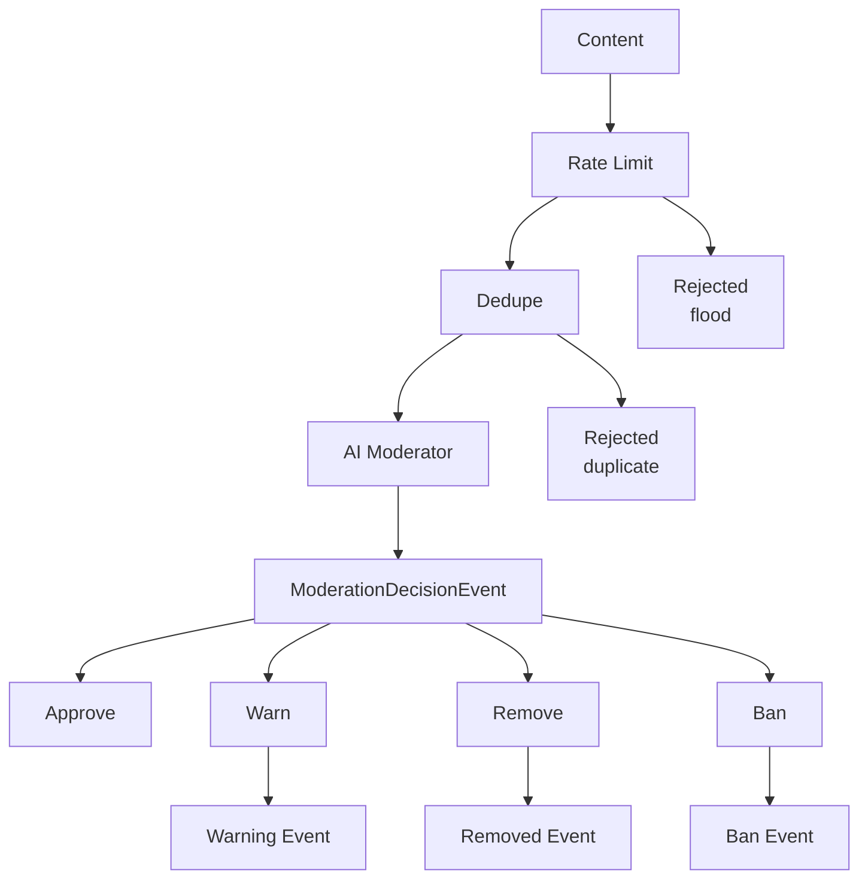

# Content Moderation Example

A real-time AI-powered content moderation system with rate limiting and automatic enforcement.

## ✨ What This Example Demonstrates

1. **Real-time Moderation**: Messages processed instantly via WebSocket/HTTP
2. **LLM Classification**: AI determines violation type and severity
3. **Rate Limiting**: Prevents spam floods (10 msgs/user/minute)
4. **Deduplication**: Ignores repeated messages within 30 seconds
5. **Graduated Enforcement**: Warn → Remove → Ban based on severity
6. **Periodic Reports**: Aggregated moderation statistics

## 🏗️ Architecture



## 📨 Event Types

| Event | Description |
|-------|-------------|
| `content.submitted` | New content for moderation |
| `moderation.decision` | AI's moderation decision |
| `moderation.warning` | Warning issued to user |
| `moderation.removed` | Content removed |
| `moderation.ban` | User banned |
| `moderation.report` | Periodic summary |

## 🚨 Violation Types

| Type | Severity | Default Action |
|------|----------|----------------|
| `none` | 0.0 | Approve |
| `spam` | 0.2-0.4 | Warn/Remove |
| `harassment` | 0.5-0.8 | Warn/Remove/Ban |
| `hate_speech` | 0.7-1.0 | Remove/Ban |
| `violence` | 0.6-1.0 | Remove/Ban |
| `adult_content` | 0.5-0.8 | Remove |
| `misinformation` | 0.4-0.7 | Warn/Remove |
| `self_harm` | 0.8-1.0 | Remove/Escalate |
| `illegal_activity` | 0.9-1.0 | Ban/Escalate |

## 🚀 Quick Start

### 📋 Prerequisites

- Python 3.11+
- PostgreSQL (or use Docker)
- Anthropic API key (for Claude)

### ⚙️ Setup

```bash
# From the repository root
cd reflex

# Install dependencies
pip install -e ".[dev]"

# Start PostgreSQL
docker-compose up -d

# Run database migrations
alembic upgrade head

# Set environment variables
export ANTHROPIC_API_KEY="your-key-here"
```

### ▶️ Run the Demo

```bash
# Run the demo script
python -m examples.content_moderation.main
```

### 🌐 Start the Full System

```bash
# Terminal 1: Start the API server
uvicorn reflex.api.app:app --reload

# Terminal 2: Monitor moderation decisions
# Watch the server logs
```

### 🧪 Test via HTTP

```bash
# Submit content for moderation
curl -X POST http://localhost:8000/events \
  -H "Content-Type: application/json" \
  -d '{
    "type": "content.submitted",
    "source": "ws:user123",
    "content_id": "msg_001",
    "user_id": "user123",
    "room_id": "general",
    "category": "chat",
    "content": "Hello everyone!"
  }'

# Test spam detection
curl -X POST http://localhost:8000/events \
  -H "Content-Type: application/json" \
  -d '{
    "type": "content.submitted",
    "source": "ws:spammer",
    "content_id": "msg_002",
    "user_id": "spammer",
    "room_id": "general",
    "category": "chat",
    "content": "BUY NOW!!! CLICK HERE!!! FREE MONEY!!!"
  }'
```

## 🔍 Filter Pipeline

### 1. Rate Limiting

```python
rate_limit_filter(max_events=10, window_seconds=60)
```

- Allows maximum 10 messages per user per minute
- Excess messages silently dropped (not processed)
- Prevents spam floods and DoS

### 2. Deduplication

```python
dedupe_filter(
    key_func=lambda e: hash(f"{e.user_id}:{e.content}"),
    window_seconds=30,
)
```

- Ignores identical messages from same user within 30 seconds
- Uses content hash for comparison
- Prevents accidental double-posts

### 3. AI Classification

```python
content_moderator = Agent(
    "anthropic:claude-sonnet-4-20250514",
    result_type=ModerationResult,
    system_prompt="You are a content moderator..."
)
```

- Analyzes content for policy violations
- Returns structured decision with reasoning
- Has access to user history via tools

## ⚖️ Enforcement Logic

### Warning Escalation

```python
# 3 warnings = automatic ban
if warning_count >= 3:
    action = ModerationAction.BAN
```

### Severity-Based Actions

| Severity | Action |
|----------|--------|
| < 0.3 | Approve or Warn |
| 0.3 - 0.6 | Warn or Remove |
| 0.6 - 0.8 | Remove |
| > 0.8 | Ban |

### Ban Scoping

```python
# Severity < 0.9: Room-specific ban
ban = UserBanEvent(room_id=event.room_id, ...)

# Severity >= 0.9: Platform-wide ban
ban = UserBanEvent(room_id=None, ...)  # Platform-wide
```

## 🧩 Key Components

### Composable Filter Chain

```python
content_filter = (
    type_filter("content.submitted")
    & rate_limit_filter(max_events=10, window_seconds=60)
    & dedupe_filter(key_func=..., window_seconds=30)
)
```

### LLM with Tools

```python
@content_moderator.tool
async def get_user_history(ctx: RunContext[ReflexDeps], user_id: str) -> str:
    """Get user's moderation history."""
    warnings = get_user_warning_count(user_id)
    violations = USER_VIOLATIONS.get(user_id, [])
    return f"User {user_id}: {warnings} warnings, violations: {violations}"
```

### Periodic Reporting

```python
@trigger(
    name="moderation-report",
    filter=type_filter("moderation.decision"),
    trigger_func=periodic_summary_trigger(
        event_count=100,      # Every 100 decisions
        max_interval_seconds=3600,  # Or every hour
    ),
    agent=report_agent,
)
```

## 🔧 Extending This Example

### Add Appeal System

```python
@EventRegistry.register
class AppealSubmittedEvent(BaseEvent):
    type: Literal["moderation.appeal"] = "moderation.appeal"
    content_id: str
    user_id: str
    appeal_reason: str

@trigger(name="appeal-handler", filter=type_filter("moderation.appeal"))
```

### Add Human Review Queue

```python
@EventRegistry.register
class HumanReviewEvent(BaseEvent):
    type: Literal["moderation.human_review"] = "moderation.human_review"
    content_id: str
    ai_decision: str
    confidence: float  # Low confidence → human review
```

### Add Category-Specific Rules

```python
# Stricter moderation for profile content
profile_filter = (
    type_filter("content.submitted")
    & keyword_filter("category", "profile")
)

# Different agent with stricter rules
@trigger(name="profile-moderator", filter=profile_filter, agent=strict_agent)
```

### Add Reputation System

```python
class UserReputation(BaseModel):
    user_id: str
    trust_score: float  # 0-1, higher = more trusted
    history: list[ModerationAction]

# Trusted users get lighter moderation
trusted_filter = source_filter(r"trusted:.*")
```

## 🏭 Production Considerations

1. **Persist State**: Store warnings/violations in database
2. **Appeal Process**: Allow users to contest decisions
3. **Audit Logging**: Keep full history for compliance
4. **A/B Testing**: Compare AI models for accuracy
5. **Human-in-the-Loop**: Escalate edge cases to human reviewers
6. **Bias Monitoring**: Track decision distribution across user groups

## ⚡ Performance

- Rate limiting handled at filter level (no DB hit)
- Deduplication uses in-memory LRU cache
- AI calls are async and parallelized per room
- Reports generated incrementally, not full scans

## 📚 Related Examples

- [Basic Example](../basic/) - Simple error monitoring
- [Support Bot](../support_bot/) - AI-powered customer support

See [docs/extending.md](../../docs/extending.md) for more details.
