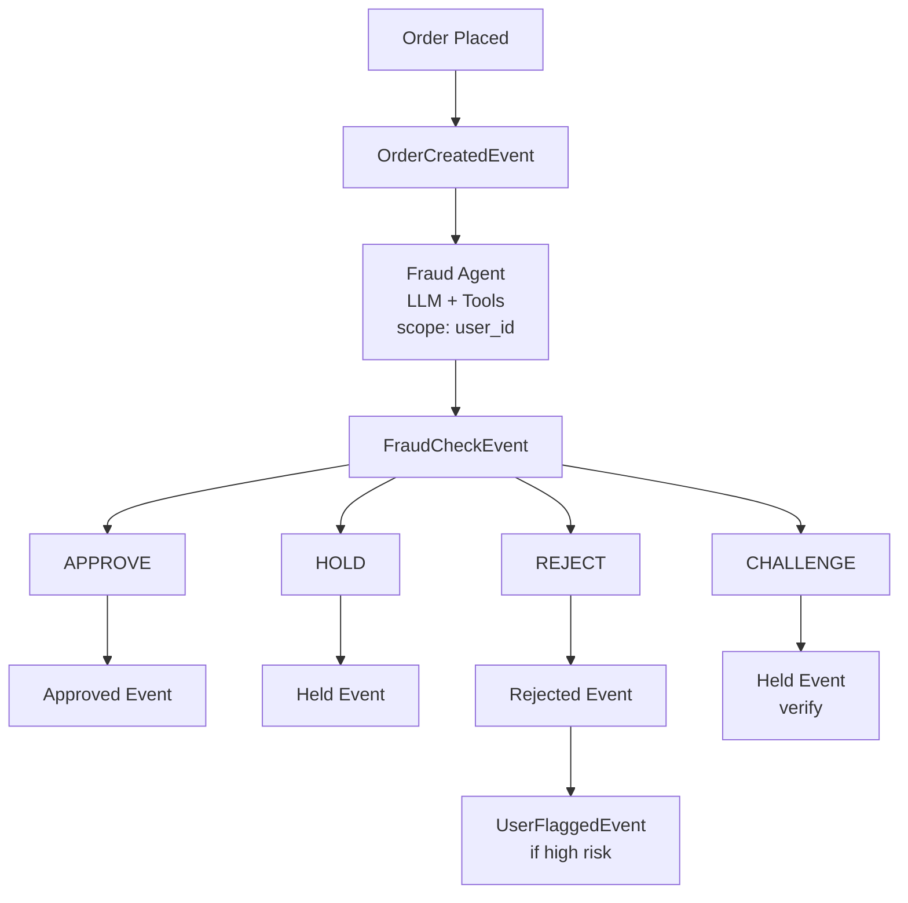

# Order Fraud Detection Example

An e-commerce fraud detection system with AI-powered risk analysis and user-scoped processing.

## ✨ What This Example Demonstrates

1. **Scoped Locking**: Orders per user processed sequentially (prevents race conditions)
2. **LLM Risk Analysis**: AI evaluates fraud signals with access to user history
3. **Tool-Based Investigation**: Agent queries velocity, geography, account age
4. **Event Lineage**: Full audit trail from order to decision
5. **Graduated Response**: Approve, hold, reject, or challenge

## 🏗️ Architecture



## 📨 Event Types

| Event | Description |
|-------|-------------|
| `order.created` | New order submitted |
| `order.fraud_check` | Fraud analysis result |
| `order.approved` | Order cleared for processing |
| `order.held` | Order held for manual review |
| `order.rejected` | Order rejected as fraudulent |
| `user.flagged` | User added to watch list |

## 🚨 Fraud Signals

| Signal | Description | Risk Level |
|--------|-------------|------------|
| `high_velocity` | 3+ orders per hour | Medium |
| `geographic_anomaly` | IP far from billing | Medium-High |
| `new_account` | Account < 7 days old | Low-Medium |
| `high_value` | Order > $500 (new user) | Medium |
| `mismatched_info` | Shipping ≠ Billing | Medium |
| `suspicious_items` | Gift cards, electronics | Medium |

## 🚀 Quick Start

### 📋 Prerequisites

- Python 3.11+
- PostgreSQL (or use Docker)
- Anthropic API key (for Claude)

### ⚙️ Setup

```bash
# From the repository root
cd reflex

# Install dependencies
pip install -e ".[dev]"

# Start PostgreSQL
docker-compose up -d

# Run database migrations
alembic upgrade head

# Set environment variables
export ANTHROPIC_API_KEY="your-key-here"
```

### ▶️ Run the Demo

```bash
# Run the demo script
python -m examples.fraud_detection.main
```

### 🌐 Start the Full System

```bash
# Terminal 1: Start the API server
uvicorn reflex.api.app:app --reload
```

### 🧪 Test Orders

```bash
# Low-risk order (trusted user)
curl -X POST http://localhost:8000/events \
  -H "Content-Type: application/json" \
  -d '{
    "type": "order.created",
    "source": "checkout:user_trusted",
    "order_id": "ord_001",
    "user_id": "user_trusted",
    "email": "trusted@example.com",
    "total_amount": 89.99,
    "currency": "USD",
    "items": [{"sku": "BOOK001", "name": "Book", "quantity": 1, "price": 89.99}],
    "shipping_address": {"country": "US", "city": "New York", "zip": "10001"},
    "billing_address": {"country": "US", "city": "New York", "zip": "10001"},
    "payment_method": "card",
    "ip_address": "192.168.1.1",
    "user_agent": "Mozilla/5.0"
  }'

# High-risk order (new account, high value, geographic mismatch)
curl -X POST http://localhost:8000/events \
  -H "Content-Type: application/json" \
  -d '{
    "type": "order.created",
    "source": "checkout:user_new",
    "order_id": "ord_002",
    "user_id": "user_new",
    "email": "newuser@temp.com",
    "total_amount": 1299.99,
    "currency": "USD",
    "items": [{"sku": "PHONE001", "name": "iPhone", "quantity": 1, "price": 1299.99}],
    "shipping_address": {"country": "NG", "city": "Lagos", "zip": "100001"},
    "billing_address": {"country": "US", "city": "New York", "zip": "10001"},
    "payment_method": "card",
    "ip_address": "172.16.0.1",
    "user_agent": "Mozilla/5.0"
  }'
```

## 🧩 Key Components

### Scoped Locking Per User

```python
@trigger(
    name="fraud-analyzer",
    filter=type_filter("order.created"),
    agent=fraud_detection_agent,
    scope_key=lambda e: f"user:{e.user_id}",  # Serialize per user
)
```

**Why this matters**: If a fraudster places 10 orders simultaneously, they're processed sequentially. This ensures accurate velocity detection and prevents race conditions.

### LLM with Investigation Tools

```python
fraud_analyzer = Agent(
    "anthropic:claude-sonnet-4-20250514",
    result_type=FraudAnalysisResult,
)

@fraud_analyzer.tool
async def get_user_order_history(ctx: RunContext[ReflexDeps], user_id: str) -> str:
    """Get user's order history."""
    # Returns order count, completion rate, lifetime value

@fraud_analyzer.tool
async def check_order_velocity(ctx: RunContext[ReflexDeps], user_id: str) -> str:
    """Check recent order frequency."""
    # Returns orders in last hour

@fraud_analyzer.tool
async def check_ip_location(ctx: RunContext[ReflexDeps], ip_address: str) -> str:
    """Geolocate IP address."""
    # Returns city, country
```

### Event Lineage

```python
# Each event links to its cause
fraud_check = ctx.derive_event(
    FraudCheckEvent,
    order_id=event.order_id,
    # ... automatically sets causation_id, correlation_id
)

approved = ctx.derive_event(
    OrderApprovedEvent,
    fraud_check_id=fraud_check.id,  # Manual reference
    # ... automatic lineage tracking
)
```

This enables full audit trail: Order → FraudCheck → Decision → UserFlag

### Decision Matrix

| Risk Score | Signals | Decision |
|------------|---------|----------|
| < 0.3 | Few/none | APPROVE |
| 0.3 - 0.5 | Some | CHALLENGE |
| 0.5 - 0.7 | Multiple | HOLD |
| > 0.7 | Severe | REJECT |

## 🔧 Extending This Example

### Add Payment Processor Integration

```python
@fraud_analyzer.tool
async def check_card_velocity(ctx: RunContext[ReflexDeps], card_hash: str) -> str:
    """Check if card has been used in fraud before."""
    # Query payment processor API
    return "Card has 0 chargebacks, used at 3 merchants"
```

### Add Device Fingerprinting

```python
@EventRegistry.register
class OrderCreatedEvent(BaseEvent):
    # ... existing fields
    device_fingerprint: str | None = None

@fraud_analyzer.tool
async def check_device_history(ctx: RunContext[ReflexDeps], fingerprint: str) -> str:
    """Check device's transaction history."""
```

### Add Machine Learning Pre-filter

```python
# Before LLM, run fast ML model
ml_score = await ml_model.predict(order_features)
if ml_score < 0.1:
    # Auto-approve low-risk, skip expensive LLM
    await ctx.publish(OrderApprovedEvent(...))
    return
# Else proceed to LLM analysis
```

### Add Manual Review Workflow

```python
@EventRegistry.register
class ReviewCompletedEvent(BaseEvent):
    type: Literal["order.review_completed"] = "order.review_completed"
    order_id: str
    reviewer_id: str
    decision: str  # "approve", "reject"
    notes: str

@trigger(name="review-handler", filter=type_filter("order.review_completed"))
```

## 🏭 Production Considerations

1. **Real User Data**: Integrate with user service, payment processor
2. **ML Pre-screening**: Use fast ML model before expensive LLM calls
3. **Velocity Tracking**: Use Redis for real-time order counting
4. **Review Queue**: Build UI for manual review workflow
5. **Feedback Loop**: Track false positives/negatives to improve models
6. **Compliance**: Log all decisions for regulatory requirements

## 📚 Related Examples

- [Content Moderation](../content_moderation/) - Similar decision flow
- [Incident Response](../incident_response/) - Escalation patterns

See [docs/extending.md](../../docs/extending.md) for more details.
