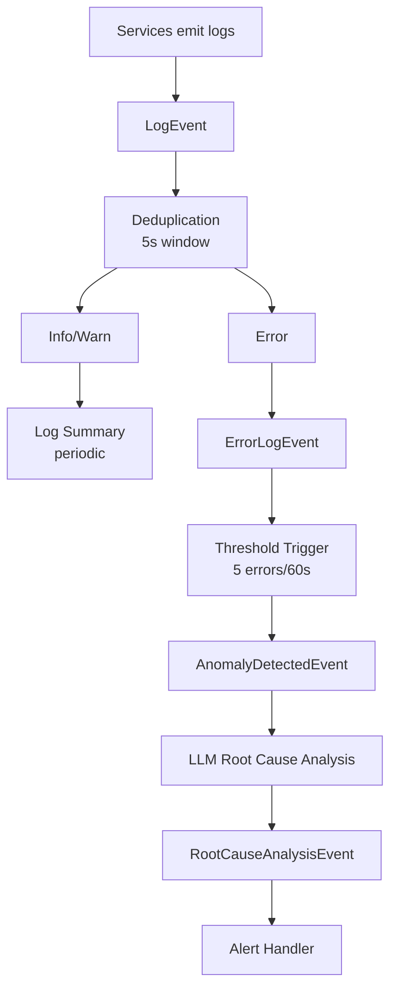

# Log Anomaly Detection Example

A multi-service log aggregation and anomaly detection system with AI-powered root cause analysis.

## ✨ What This Example Demonstrates

1. **Log Aggregation**: Collect logs from multiple services
2. **Deduplication**: Filter out duplicate log entries
3. **Threshold Detection**: Alert after N errors in time window
4. **LLM Correlation**: AI analyzes patterns across services
5. **Root Cause Analysis**: Automatic diagnosis and recommendations

## 🏗️ Architecture



## 📨 Event Types

| Event | Description |
|-------|-------------|
| `log.entry` | Raw log from any service |
| `log.error` | Error-level logs for tracking |
| `log.anomaly` | Anomaly detected (threshold exceeded) |
| `log.root_cause` | AI analysis result |
| `log.summary` | Periodic aggregation |

## 🚨 Anomaly Types

| Type | Description |
|------|-------------|
| `error_spike` | Sudden increase in error rate |
| `latency_spike` | Response times increasing |
| `memory_leak` | Memory usage growing over time |
| `connection_failure` | Database/service connection issues |
| `cascade_failure` | Errors spreading across services |

## 🚀 Quick Start

### 📋 Prerequisites

- Python 3.11+
- PostgreSQL (or use Docker)
- Anthropic API key (for Claude)

### ⚙️ Setup

```bash
# From the repository root
cd reflex

# Install dependencies
pip install -e ".[dev]"

# Start PostgreSQL
docker-compose up -d

# Run database migrations
alembic upgrade head

# Set environment variables
export ANTHROPIC_API_KEY="your-key-here"
```

### ▶️ Run the Demo

```bash
# Run the demo script
python -m examples.log_anomaly.main
```

### 🌐 Start the Full System

```bash
# Terminal 1: Start the API server
uvicorn reflex.api.app:app --reload
```

### 🧪 Send Test Logs

```bash
# Normal info log
curl -X POST http://localhost:8000/events \
  -H "Content-Type: application/json" \
  -d '{
    "type": "log.entry",
    "source": "fluentd:api-gateway-prod",
    "service": "api-gateway",
    "environment": "production",
    "level": "info",
    "message": "Request processed successfully"
  }'

# Error log
curl -X POST http://localhost:8000/events \
  -H "Content-Type: application/json" \
  -d '{
    "type": "log.entry",
    "source": "fluentd:user-service-prod",
    "service": "user-service",
    "environment": "production",
    "level": "error",
    "message": "Database connection timeout",
    "context": {"error_type": "ConnectionError"}
  }'

# Send 5+ errors within 60 seconds to trigger anomaly detection
```

## 🧩 Key Components

### Log Deduplication

```python
log_dedupe = dedupe_filter(
    key_func=lambda e: f"{e.service}:{e.level}:{e.message[:100]}",
    window_seconds=5,
)
```

Prevents duplicate logs from creating noise. Same service + level + message within 5 seconds is ignored.

### Threshold-Based Anomaly Detection

```python
@trigger(
    name="anomaly-detector",
    filter=type_filter("log.error"),
    trigger_func=error_threshold_trigger(
        threshold=5,
        window_seconds=60,
        error_types=["log.error"],
    ),
    agent=anomaly_detector,
)
```

Fires when 5 or more errors occur within 60 seconds.

### LLM Root Cause Analysis

```python
root_cause_analyzer = Agent(
    "anthropic:claude-sonnet-4-20250514",
    result_type=CorrelationResult,
    system_prompt="You are a DevOps engineer analyzing log anomalies..."
)

@root_cause_analyzer.tool
async def get_service_error_history(ctx: RunContext[ReflexDeps], service: str) -> str:
    """Get recent error history for a service."""
    errors = get_service_errors(service)
    return f"Service {service} recent errors:\n" + "\n".join(errors)
```

The LLM can query error history across services to correlate failures.

### Source Filtering

```python
filter=type_filter("log.entry") & source_filter(r".*-prod.*")
```

Only process logs from production services (source contains "-prod").

## 🔄 Event Flow Example

```
1. api-gateway-prod: ERROR - Upstream timeout
2. user-service-prod: ERROR - DB connection refused
3. auth-service-prod: ERROR - Redis unavailable
4. user-service-prod: ERROR - Query failed
5. payment-service-prod: ERROR - Transaction timeout
   └─→ Threshold reached (5 errors)
       └─→ AnomalyDetectedEvent created
           └─→ LLM analyzes pattern
               └─→ Root Cause: "Database overload causing cascade"
                   └─→ Alert: "Scale DB, enable connection pooling"
```

## 🔧 Extending This Example

### Add Service Dependencies

```python
SERVICE_DEPENDENCIES = {
    "api-gateway": ["user-service", "auth-service"],
    "user-service": ["postgres", "redis"],
    "auth-service": ["redis"],
}

@root_cause_analyzer.tool
async def get_service_dependencies(ctx: RunContext[ReflexDeps], service: str) -> str:
    deps = SERVICE_DEPENDENCIES.get(service, [])
    return f"{service} depends on: {', '.join(deps)}"
```

### Add Metric Correlation

```python
@EventRegistry.register
class MetricEvent(BaseEvent):
    type: Literal["metric.value"] = "metric.value"
    service: str
    metric_name: str  # "cpu", "memory", "latency"
    value: float
    unit: str
```

### Add Runbook Integration

```python
@root_cause_analyzer.tool
async def get_runbook(ctx: RunContext[ReflexDeps], issue_type: str) -> str:
    """Get runbook for known issue types."""
    runbooks = {
        "db_connection": "1. Check DB health\n2. Verify connection pool\n3. Scale if needed",
        "redis_failure": "1. Check Redis cluster\n2. Failover if primary down",
    }
    return runbooks.get(issue_type, "No runbook found. Escalate to on-call.")
```

## 🏭 Production Considerations

1. **Log Shipping**: Use Fluentd, Filebeat, or Vector to send logs
2. **Sampling**: For high-volume services, sample logs at source
3. **Retention**: Configure event store retention for logs
4. **Dashboards**: Export summaries to Grafana/Datadog
5. **On-Call Integration**: Send alerts to PagerDuty/OpsGenie

## 📚 Related Examples

- [Basic Example](../basic/) - Simple error monitoring
- [Incident Response](../incident_response/) - Full incident lifecycle

See [docs/extending.md](../../docs/extending.md) for more details.
