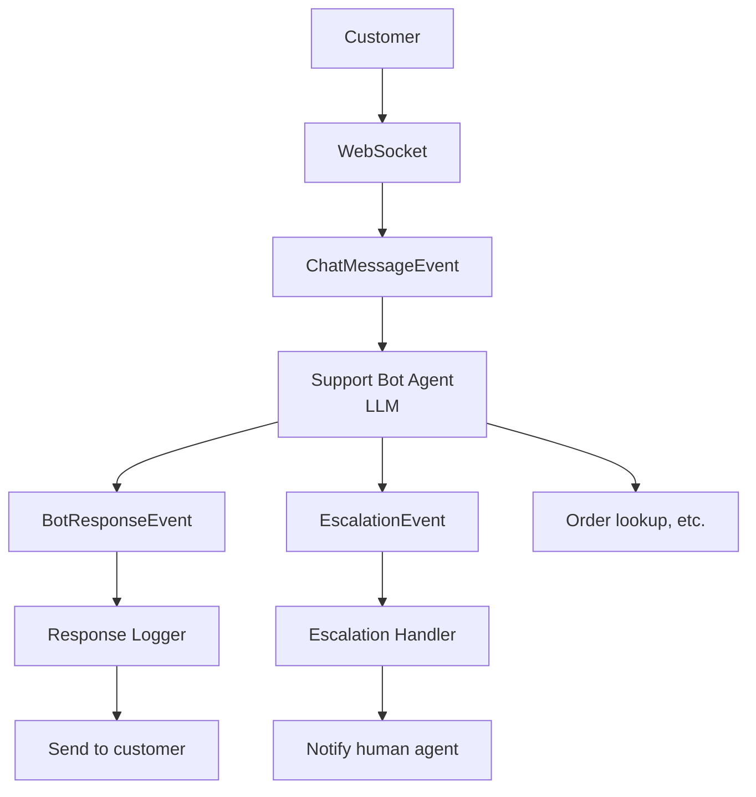

# Customer Support Bot Example

An AI-powered customer support system with real-time chat and automatic escalation.

## ✨ What This Example Demonstrates

1. **WebSocket Integration**: Real-time chat via WebSocket connections
2. **LLM Intent Classification**: AI-powered understanding of customer requests
3. **Automatic Escalation**: Complex issues routed to human agents
4. **Event Chaining**: Messages trigger responses, escalations trigger notifications
5. **Scoped Concurrency**: Conversations processed in order per user

## 🏗️ Architecture



## 📨 Event Types

| Event | Description |
|-------|-------------|
| `chat.message` | Incoming customer message |
| `chat.bot_response` | Bot's response to customer |
| `support.escalation` | Request for human agent |
| `support.escalation_timeout` | Escalation not acknowledged |
| `support.resolved` | Conversation completed |

## 🚀 Quick Start

### 📋 Prerequisites

- Python 3.11+
- PostgreSQL (or use Docker)
- Anthropic API key (for Claude)

### ⚙️ Setup

```bash
# From the repository root
cd reflex

# Install dependencies
pip install -e ".[dev]"

# Start PostgreSQL
docker-compose up -d

# Run database migrations
alembic upgrade head

# Set environment variables
export ANTHROPIC_API_KEY="your-key-here"
```

### ▶️ Run the Demo

```bash
# Run the demo script
python -m examples.support_bot.main
```

### 🌐 Start the Full System

```bash
# Terminal 1: Start the API server
uvicorn reflex.api.app:app --reload

# Terminal 2: Connect as a customer
websocat ws://localhost:8000/ws/customer123
# Then type: {"content": "Hello, I need help!"}
```

### 🧪 Test via HTTP

```bash
# Simulate a chat message
curl -X POST http://localhost:8000/events \
  -H "Content-Type: application/json" \
  -d '{
    "type": "chat.message",
    "source": "ws:customer123",
    "conversation_id": "conv001",
    "user_id": "customer123",
    "message": "What is your return policy?"
  }'
```

## 🎯 Intent Classification

The LLM classifies messages into these intents:

| Intent | Behavior |
|--------|----------|
| `greeting` | Warm welcome response |
| `faq` | Answer from knowledge base |
| `order_status` | Request order number, look up |
| `technical_issue` | Gather details, escalate if complex |
| `billing` | Always escalate to human |
| `complaint` | Apologize, escalate |
| `escalation_request` | Immediately connect to human |
| `unknown` | Low confidence → escalate |

## ⬆️ Escalation Logic

Escalation occurs when:
- Customer explicitly requests human agent
- Message is a complaint
- LLM confidence is below 50%
- Billing or sensitive issues detected

Escalation priorities:
- **urgent**: System-detected critical issue
- **high**: Complaints, explicit escalation requests
- **medium**: Complex technical issues
- **low**: Clarification needed

## 🧩 Key Components

### LLM Agent with Tools

```python
intent_classifier = Agent(
    "anthropic:claude-sonnet-4-20250514",
    deps_type=ReflexDeps,
    result_type=ClassificationResult,
    system_prompt="You are a customer support classifier..."
)

@intent_classifier.tool
async def lookup_faq(ctx: RunContext[ReflexDeps], topic: str) -> str:
    """Look up FAQ information."""
    # Agent can call this tool to get answers
```

### Scoped Processing

```python
@trigger(
    name="support-bot",
    filter=type_filter("chat.message"),
    agent=support_bot_agent,
    scope_key=lambda e: f"conversation:{e.conversation_id}",
)
```

Messages from the same conversation are processed in order, while different conversations run in parallel.

### Event Derivation

```python
# Create related event with automatic lineage tracking
response = ctx.derive_event(
    BotResponseEvent,
    conversation_id=event.conversation_id,
    message="Here's your answer...",
)
await ctx.publish(response)
```

## 🔧 Extending This Example

### Add Human Agent Interface

```python
@EventRegistry.register
class AgentJoinedEvent(BaseEvent):
    type: Literal["support.agent_joined"] = "support.agent_joined"
    conversation_id: str
    agent_id: str
    agent_name: str
```

### Add Sentiment Tracking

```python
class ClassificationResult(BaseModel):
    intent: IntentType
    sentiment: Literal["positive", "neutral", "negative", "frustrated"]
    # ... existing fields
```

### Add Response Templates

```python
TEMPLATES = {
    IntentType.GREETING: "Hello! I'm here to help. What can I do for you today?",
    IntentType.FAQ: "{faq_answer}\n\nIs there anything else?",
}
```

## 🏭 Production Considerations

1. **Persist Conversations**: Store conversation history in database
2. **Human Agent Queue**: Integrate with agent assignment system
3. **Response Time SLAs**: Add escalation timeout triggers
4. **Analytics**: Track intent distribution, resolution rates
5. **Fallback Handling**: Graceful degradation when LLM unavailable

## 📚 Related Examples

- [Basic Example](../basic/) - Simple error monitoring
- [Content Moderation](../content_moderation/) - Real-time message filtering

See [docs/extending.md](../../docs/extending.md) for more details.
